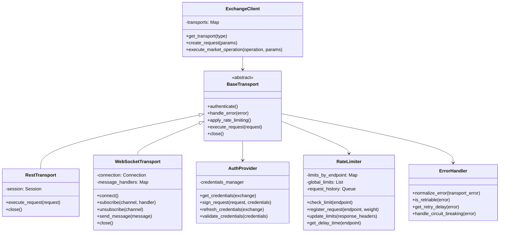
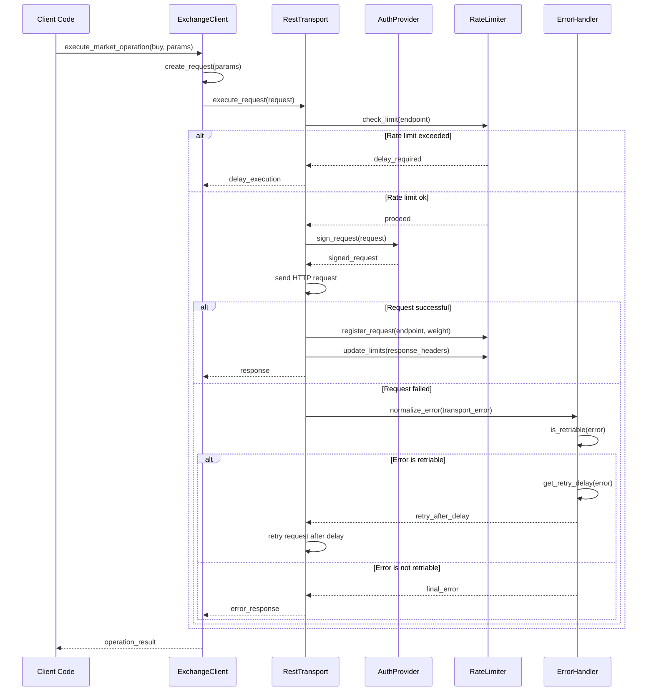
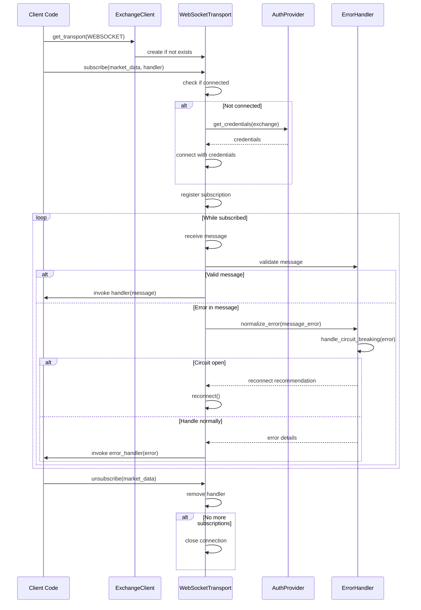

# Unified Exchange Adapter Architecture

## Overview

The Unified Exchange Adapter is designed to provide a consistent interface for interacting with various cryptocurrency exchanges through different transport methods (REST and WebSocket). This architecture enables code reuse, consistent error handling, and uniform authentication and rate limiting across transport types.

## Core Components

### 1. Class Diagram



### 2. Sequence Diagram - REST Request Flow



### 3. Sequence Diagram - WebSocket Flow



## Component Details

### 1. Base Transport Interface (`src/exchange/transport/base.py`)

The `BaseTransport` abstract class defines the common interface for all transport methods:

- `authenticate()`: Establishes and validates credentials
- `handle_error(error)`: Processes and normalizes transport-specific errors
- `apply_rate_limiting()`: Ensures request rate adherence
- `execute_request(request)`: Executes a transport-specific request
- `close()`: Closes connections and performs cleanup

### 2. Authentication Provider (`src/exchange/auth/provider.py`)

The `AuthProvider` manages authentication across transport types:

- Works with both REST and WebSocket connections
- Integrates with the Secret Manager from Task 1
- Supports multiple authentication methods (API key/secret, JWT, OAuth)
- Handles credential rotation and refresh
- Provides signing utilities for authenticated requests

### 3. Rate Limiter (`src/exchange/rate_limiting/limiter.py`)

The enhanced `RateLimiter` tracks and enforces rate limits:

- Tracks limits across all transport types
- Supports per-endpoint and global weight-based limits
- Implements dynamic limit adjustment based on response headers
- Provides intelligent request queuing with priority support
- Handles backoff strategies for rate limit errors

### 4. Error Handler (`src/exchange/exceptions.py`)

The `ErrorHandler` standardizes error handling:

- Normalizes errors across transport types
- Provides detailed context for debugging
- Supports retry policies and circuit breaking
- Categorizes errors (connectivity, authentication, rate limit, exchange-specific)
- Implements exponential backoff for transient errors

### 5. Request/Response Models

The data models provide transport-agnostic representations:

- `Request` models with standardized parameters
- `Response` models with normalized structure
- Serialization/deserialization utilities
- Consistent typing and validation

## Implementation Notes

### Directory Structure

```
src/exchange/
├── __init__.py
├── client.py                 # Unified client interface
├── exceptions.py             # Error models and handler
├── base.py                   # Common utilities
├── transport/
│   ├── __init__.py
│   ├── base.py               # Base transport interface
│   ├── rest.py               # REST implementation
│   └── websocket.py          # WebSocket implementation
├── auth/
│   ├── __init__.py
│   ├── provider.py           # Authentication provider
│   └── credentials.py        # Credential models
└── rate_limiting/
    ├── __init__.py
    ├── limiter.py            # Rate limiter
    └── models.py             # Rate limit models
```

### Design Patterns

1. **Strategy Pattern**: Used for transport selection, allowing the client to switch between REST and WebSocket seamlessly.

2. **Factory Pattern**: Employed in the ExchangeClient to create appropriate transport instances.

3. **Repository Pattern**: Used for data access and normalization, providing a consistent interface for exchange-specific implementations.

4. **Singleton Pattern**: Applied to shared components like the rate limiter and authentication provider to ensure consistency.

5. **Observer Pattern**: Implemented for event notifications across transports, especially for WebSocket subscriptions.

6. **Adapter Pattern**: Used to normalize exchange-specific APIs into a consistent interface.

## Extension Points

The architecture supports extension in the following ways:

1. **New Transport Types**: Additional transport methods can be added by implementing the BaseTransport interface.

2. **Exchange-Specific Implementations**: Exchange-specific behavior can be encapsulated in dedicated classes that implement the common interfaces.

3. **Custom Rate Limiting Strategies**: The rate limiter can be extended with custom strategies for different exchanges.

4. **Authentication Methods**: New authentication methods can be added to the AuthProvider.

## Conclusion

This unified exchange adapter architecture provides a solid foundation for interacting with cryptocurrency exchanges through multiple transport methods. By sharing common components like authentication, rate limiting, and error handling, it ensures consistency while allowing for transport-specific optimizations.

The design prioritizes:
- Code reuse and maintainability
- Consistent error handling
- Uniform authentication and rate limiting
- Extensibility for future transport methods
- Exchange-specific customization when needed 